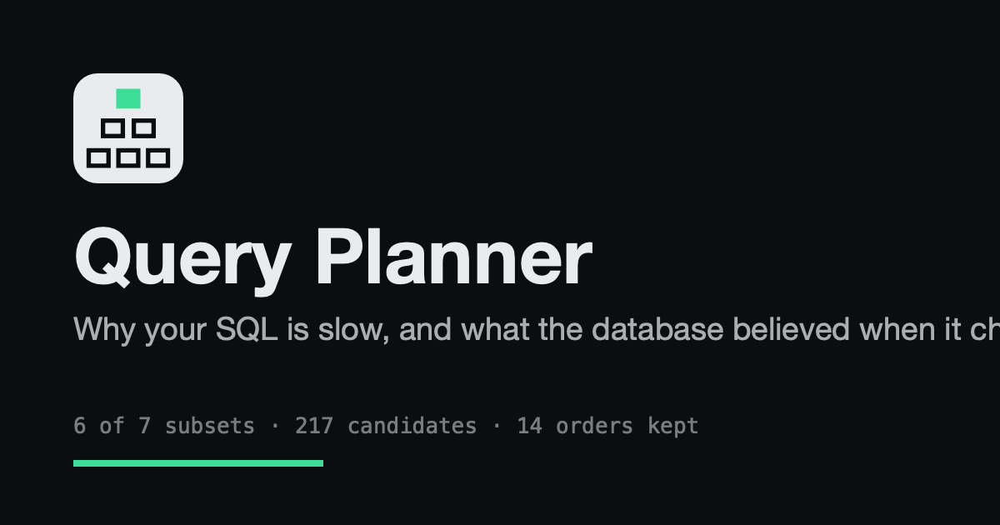

<div align="center">

<picture>
  <source media="(prefers-color-scheme: dark)" srcset="public/brand/lockup-dark.png">
  <source media="(prefers-color-scheme: light)" srcset="public/brand/lockup-light.png">
  
</picture>

### Why your SQL is slow, and what the database believed when it chose

[**Open the app**](https://andifathulms.github.io/query-planner/) &nbsp;·&nbsp;
[What and why](PRD.md) &nbsp;·&nbsp;
[How it looks](DESIGN.md) &nbsp;·&nbsp;
[Build brief](CLAUDE.md)

[](https://github.com/andifathulms/query-planner/actions/workflows/deploy.yml)


</div>

---

A static single-page application containing its own database engine: storage, a B+tree index,
statistics collected from a real sample, selectivity estimation, a cost model, Selinger plan
enumeration, and a volcano-model executor. No SQL library ships in the bundle. Nothing leaves
the device.

Every quantity in it exists twice: what the planner **believed**, and what turned out to be
**true**. The whole interface is built to make the distance between those two numbers a length
you see before you read anything.

<div align="center">

</div>

## Why an engine rather than a wrapper

`EXPLAIN` shows you the winner. It does not show the sixty-two candidate plans that lost, and
that search is the most visual thing in the subject. The app's central claim also needs the
estimate and the truth side by side at every node, from one system, and only an engine you
control produces both.

## What you can do with it

| | |
|---|---|
| **Watch the search** | The Selinger DP fills level by level, replaying the real enumeration order rather than an idealised sweep. Every candidate it considered stays in the cell, including the losers. |
| **Find the plan flip** | Drag `random_page_cost` from 4.0 toward 1.1 and watch the cost bars cross and the plan rebuild. It tracks the pointer with no easing, so the threshold is where you put it. |
| **See the estimate fail** | The correlation plot draws selectivity as area. Independence predicts a small square; the truth is a much larger one at the same anchor, and the gap between them is the error. |
| **Repair it** | Create a multivariate statistic and the estimate moves toward the truth, the plan re-plans, and the query re-executes. That whole chain runs from one click. |
| **Share the counterexample** | Everything except the current selection serialises to the URL. A surprising plan is a link. |

## Running it

```bash
npm install
npm run dev        # the app
npm test           # 255 tests
npm run oracle     # plan-shape agreement against PGlite
npm run build      # production bundle
```

`@electric-sql/pglite` is a devDependency and never ships. It is the oracle: identical data
goes into real Postgres, and the test asserts this planner picks the same plan shape.

## Layout

```
src/
  parser/     recursive descent over the accepted SQL subset
  storage/    columnar tables, a bulk-loaded B+tree, the generators
  stats/      reservoir sampling, MCV, histograms, multivariate statistics
  planner/    selectivity, cost, access paths, interesting orders, the DP
  executor/   volcano operators, one per file, with instrumentation
  views/      the eight instruments
  state/      the store, URL serialisation, and measurement of the truth
```

Three boundaries are enforced rather than intended:

- `src/planner/` may not import `src/storage/` or `src/executor/`. A planner that can peek at
  the truth is not a planner. The rule is in `eslint.config.js`.
- No engine module imports React, the DOM, or `Math.random`. All randomness runs through the
  seeded PRNG, so a seed reproduces a plan exactly.
- Statistics come from a sample, always. Sampling error is part of the subject.

## What is not modelled

The cost model is real, with real parameters, and it is not Postgres. Every simplification is
listed in `SIMPLIFICATIONS` (`src/planner/cost.ts`) and shown in the interface next to the
number it affects. The cases where a simplification actually changed a decision are in
`src/planner/divergences.ts`, found by the oracle and asserted still to diverge. Bitmap heap
scans are the largest gap.

Estimates and actuals come from one engine, which makes their pairing exact and also means
real Postgres would give different numbers.

## Interface notes

Two themes, following the system unless you pick one. The theme is the one piece of state
that stays out of the URL: a shared link carries a plan, and forcing a colleague into your
colour scheme to show them a plan would be rude.

Reduced motion is honoured throughout. The lattice fills instantly with the stepper still
available, the plan descent becomes a state change, the recovery becomes a before and after.

`tests/copy.test.ts` enforces the copy rules a person cannot hold in their head: no em-dashes
in shippable strings, no marketing filler, no two eyebrows naming different things.

## The mark

The icon is the planner's own DP lattice: cells at level one, the kept plan above them, and
only the kept cell filled. It says search rather than storage, which is the distinction the
app exists to make.

<div align="center">

</div>

Brand source artboards live in `exports/` and are not committed. `public/brand/` carries the
subset the app actually serves.
